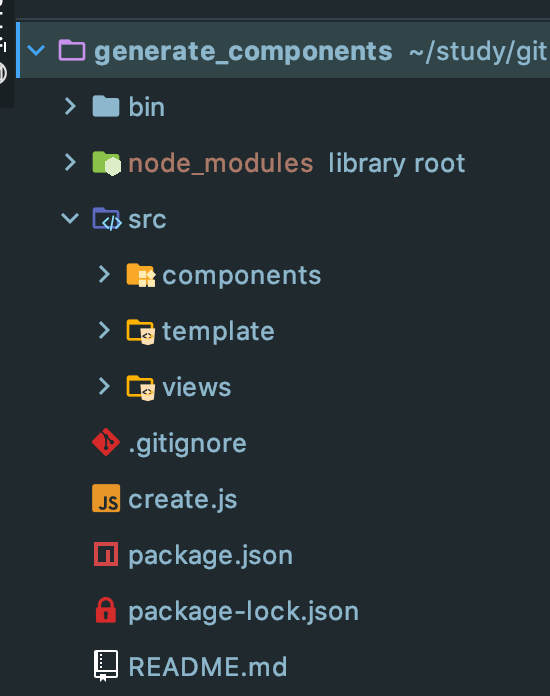

## 脚本生成vue模版组件

​	以一个简单的项目为例,文件夹布局如下所示



> **编写模版文件**

​	在template文件夹中新增模板文件index.js, 内容分别如下:

```javascript
module.exports = {
  vueTemp: (compName) => {
		return `<template>
  
</template>

<script>
    export default {
        name: '${compName}'
    }
</script>

<style scoped lang="scss">

</style>`
	},
  entryTempL: (compName) => {
    return `import ${compName} from './index.vue';
export default ${compName}`
  }
}
```

可以看出向外暴露了两个属性模板,需要时引入即可;

> **新建generateComponent.js文件**

- 写入数据到新的文件方法

  ```javascript
  function generateComponent = (path, data) {
    if (fs.existsSync(path)) {
      errorLog(`${path}文件已存在`)
    }
    
    return new Promise((res, rej) => {
      fs.writeFile(path, data, 'utf8', (err) => {
        if (err) {
          errorLog(err.message)
          rej(err)
        } else {
          res(true)
        }
      })
    })
  }
  ```

- 获取输入的字符:

  ```javascript
  process.stdin.on('data', chunk => {
    // chunk为输入的字符
  })
  ```

- 中止当前进程:

  ```javascript
  process.exit();
  ```

- 递归创建文件夹

```javascript
function mkdir(directory, callback) {
    var exists = fs.existsSync(directory)
    if (exists) {
        callback()
    } else {
        mkdir(path.dirname(directory), function () {
            fs.mkdirSync(directory)
            callback()
        })
    }
}
```

- 最终文件:

```javascript
const chalk = require('chalk');
const path = require('path')
const fs = require('fs')

const log = (message) => console.log(chalk.green(message));
const successLog = (message) => console.log(chalk.blue(message));
const errorLog = (message) => console.log(chalk.red(message));
const resolve = (...file) => path.resolve(__dirname, ...file)
// 导入模板
const {
    vueTemplate,
    entryTemplate
} = require('./src/template/index')

// 生成文件
const generateFile = (path, data) => {
    if (fs.existsSync(path)) {
        errorLog(`${path}文件已存在`)
        return
    }

    return new Promise((res, rej) => {
        fs.writeFile(path, data, 'utf8', err => {
            if (err) {
                errorLog(err.message)
                rej(err)
            } else {
                res(true)
            }
        })
    })
}

log('请输入想要创建的文件:')
let componentName = ''
process.stdin.on('data', async function (chunk){
    // 组件名称
    const inputName = String(chunk).trim().toString()
    // Vue页面组件路径
    const componentPath = resolve('./src/views', inputName)
    // vue文件
    const vueFile = resolve(componentPath, 'main.vue')
    // 入口文件
    const entryFile = resolve(componentPath, 'entry.js')
    // 判断组件文件夹是否存在
    const hasComponentExists = fs.existsSync(componentPath)
    if (hasComponentExists) {
        errorLog(`${inputName}页面组件已存在， 请重新输入`)
        return
    } else {
        log(`正在生成component目录 ${componentPath}`)
        await dotExistDirectoryCreate(componentPath)
    }

    try {
        // 获取组件名
        if (inputName.includes('/')) {
            const inputNameArr = inputName.split('/')
            componentName = inputNameArr[inputNameArr.length - 1]
        } else {
            componentName = inputName
        }
        log(`正在生成vue文件 ${vueFile}`)
        await generateFile(vueFile, vueTemplate(componentName))
        successLog('生成组件成功')
        await generateFile(entryFile, entryTemplate(componentName))
    } catch(err) {
        errorLog(err.message)
    }

    process.stdin.emit('end')
})

process.stdin.on('end', () => {
    log('exit')
    process.exit()
})

function dotExistDirectoryCreate(directory) {
    return new Promise((resolve) => {
        mkdir(directory, function () {
            resolve(true)
        })
    })
}

function mkdir(directory, callback) {
    var exists = fs.existsSync(directory)
    if (exists) {
        callback()
    } else {
        mkdir(path.dirname(directory), function () {
            fs.mkdirSync(directory)
            callback()
        })
    }
}

```

