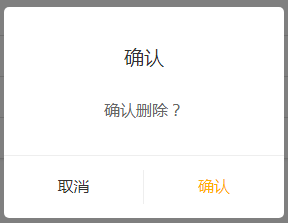

## VUE实现命令式弹窗组件

​		在开发vue项目的过程中，很多场景需要弹出一些公用的确认弹框，这种时候通过传参调用弹窗api不失为一个合适的方案：




> **实现步骤**

1. 写出组件结构
2. 转为命令式可调用api
3. 将调用方法挂在到全局

> **组件结构**

```vue
components/confirm.vue

<template>
  <div class="confirm" v-show="showConfirm">
    <div class="confirm-wrapper">
      <div class="confirm-content">
        <p class="title">{{title}}</p>
        <div class="operate-box" @click.stop>
          <div class="operate-btn operation-cancel" @click="cancel">{{cancelBtnText}}</div>
          <div class="operate-btn" @click="confirm">{{ConfirmBtnText}}</div>
    		</div>
    	</div>
    </div>
  </div>
</template>

<script>
export default {
  data() {
    return {
      showConfirm: false,
      title: "确认以下操作吗?", 
      ConfirmBtnText: "确定",
      cancelBtnText: "取消"
    };
  },
  methods: {
    show(func) {
      this.showConfirm = true;
      typeof func === "function" && func.call(this, this);
      return new Promise((resolve, reject) => {
        this.reject = reject;
        this.resolve = resolve;
      });
    },
    cancel() {
      this.reject("cancel");
      this.hide();
    },
    confirm() {
      this.resolve("confirm");
      this.hide();
    },
    hide() {
      this.showConfirm = false;
      document.body.removeChild(this.$el);
      this.$destroy();
    }
  }
};
</script>

<style scoped lang="stylus">
.confirm {
  position: fixed;
  left: 0;
  top: 0;
  right: 0;
  bottom: 0;
  z-index: 9998;
  background-color: rgba(0, 0, 0, 0.6);
  
  .confirm-wrapper {
    position: absolute;
    top: 50%;
    left: 50%;
    transform: translate(-50%, -50%);
    z-index: 9999;
    .confirm-content {
      width: 270px;
      border-radius: 15px;
      background: #333;
      .title {
        padding: 15px 12px;
        line-height: 22px;
        text-align: center;
        font-size: 16px;
        color: #fff;
      }
      .operate-box {
        display: flex;
        align-items: center;
        text-align: center;
        font-size: 18px;
        .operate-btn {
          flex: 1;
          line-height: 22px;
          padding: 10px 0;
          border-top: 1px solid rgba(0, 0, 0, 0.3);
          color: rgba(255, 255, 255, 0.3);
          &.confirm {
            border-right: 1px solid rgba(0, 0, 0, 0.3);
          }
        }
      }
    }
  }
}
</style>

```

> **转为命令式可调用api**

```js
confirm/index.js

import Vue from 'vue';
import Confirm from './confirm';  // 引入组件

let newInstance;
const ConfirmInstance = Vue.extend(Confirm);  // 创建构造函数

const initInstance = () => { // 执行方法后完成挂载
  newInstance = new ConfirmInstance();  // 实例化
  document.body.appendChild(newInstance.$mount().$el);
  // 实例化后手动挂载，得到$el真实Dom，将其添加到body最后
}

export default options => { 导出一个方法，接受配置参数
  if (!newInstance) {
    initInstance(); // 挂载
  }
  Object.assign(newInstance, options);
  // 实例化后newInstance就是一个对象了，所以data内的数据会
  // 挂载到this下，传入一个对象与之合并
  
  return newInstance.show(vm => {  // 显示弹窗
    newInstance = null;  // 将实例对象清空
  })
}

```

> **挂载到全局**

```js
import Confirm from './components/index';

Vue.prototype.$Confirm = Confirm;

```

> **调用格式**

```javascript
this.$confirm(options).then(confirm => {}).catch(cancel => {})
```